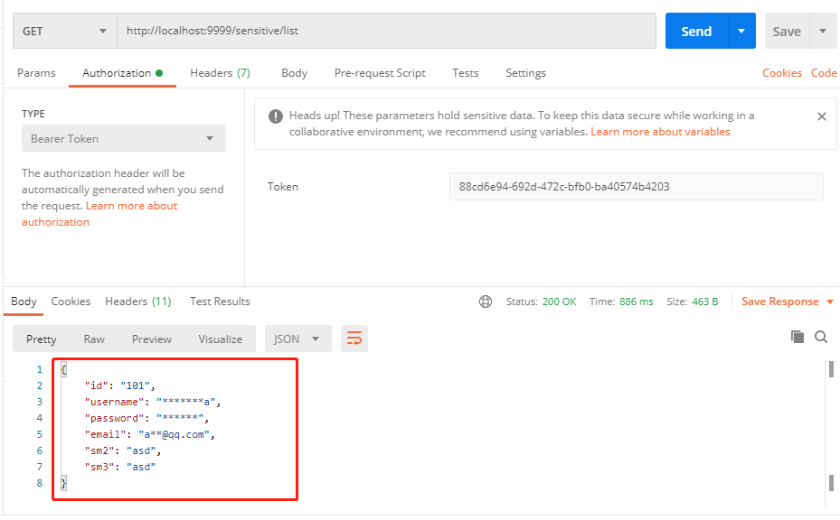

# 一、数据脱敏

> 什么是数据脱敏：数据脱敏又称数据去隐私化或数据变形，是在给定的规则、策略下对敏感数据进行变换、修改的技术机制，能够在很大程度上解决敏感数据在非可信环境中使用的问题。
> 根据数据保护规范和脱敏策略，对业务数据中的敏感信息实施自动变形，实现对敏感信息的隐藏。

## 数据脱敏的方法有哪些?

> 几种常见的脱敏方法包括：替换、置乱、均值化、反推断、偏移和FPE（Format Preserving Encryption）。

### 1.1 平台使用方法

> 本平台采用的是替换法。什么是替换法呢，以虚构的数据代替真值。例如，建立一个较大的虚拟值数据表，对每一真实值记录产生随机种子，对原始数据内容进行哈希映射替换。这种方法得到的数据与真实数据非常相似。
> 无效化：以NULL 或***** 代替真值或真值的一部分，如遮盖信用卡号的后12位。

字符替换工具类DesensitizedUtils如下：

```java
public class DesensitizedUtils {
    /**
     * 对字符串进行脱敏操作
     *
     * @param origin          原始字符串
     * @param prefixNoMaskLen 左侧需要保留几位明文字段
     * @param suffixNoMaskLen 右侧需要保留几位明文字段
     * @param maskStr         用于遮罩的字符串, 如'*'
     * @return 脱敏后结果
     */
    public static String desValue(String origin, int prefixNoMaskLen, int suffixNoMaskLen, String maskStr) {
        if (origin == null) {
            return null;
        }

        StringBuilder sb = new StringBuilder();
        for (int i = 0, n = origin.length(); i < n; i++) {
            if (i < prefixNoMaskLen) {
                sb.append(origin.charAt(i));
                continue;
            }
            if (i > (n - suffixNoMaskLen - 1)) {
                sb.append(origin.charAt(i));
                continue;
            }
            sb.append(maskStr);
        }
        return sb.toString();
    }

    /**
     * 【中文姓名】只显示最后一个汉字，其他隐藏为星号，比如：**梦
     *
     * @param fullName 姓名
     * @return 结果
     */
    public static String chineseName(String fullName) {
        if (fullName == null) {
            return null;
        }
        return desValue(fullName, 0, 1, "*");
    }

    /**
     * 【身份证号】显示前六位, 四位，其他隐藏。共计18位或者15位，比如：340304*******1234
     *
     * @param id 身份证号码
     * @return 结果
     */
    public static String idCardNum(String id) {
        return desValue(id, 6, 4, "*");
    }

    /**
     * 【固定电话】后四位，其他隐藏，比如 ****1234
     *
     * @param num 固定电话
     * @return 结果
     */
    public static String fixedPhone(String num) {
        return desValue(num, 0, 4, "*");
    }

    /**
     * 【手机号码】前三位，后四位，其他隐藏，比如135****6810
     *
     * @param num 手机号码
     * @return 结果
     */
    public static String mobilePhone(String num) {
        return desValue(num, 3, 4, "*");
    }

    /**
     * 【地址】只显示到地区，不显示详细地址，比如：北京市海淀区****
     *
     * @param address 地址
     * @return 结果
     */
    public static String address(String address) {
        return desValue(address, 6, 0, "*");
    }

    /**
     * 【电子邮箱 邮箱前缀仅显示第一个字母，前缀其他隐藏，用星号代替，@及后面的地址显示，比如：d**@126.com
     *
     * @param email 电子邮箱
     * @return 结果
     */
    public static String email(String email) {
        if (email == null) {
            return null;
        }
        int index = StrUtil.indexOf(email, '@');
        if (index <= 1) {
            return email;
        }
        String preEmail = desValue(email.substring(0, index), 1, 0, "*");
        return preEmail + email.substring(index);

    }

    /**
     * 【银行卡号】前六位，后四位，其他用星号隐藏每位1个星号，比如：622260**********1234
     *
     * @param cardNum 银行卡号
     * @return 结果
     */
    public static String bankCard(String cardNum) {
        return desValue(cardNum, 6, 4, "*");
    }

    /**
     * 【密码】密码的全部字符都用*代替，比如：******
     *
     * @param password 密码
     * @return 结果
     */
    public static String password(String password) {
        if (password == null) {
            return null;
        }
        return "******";
    }

    /**
     * 【密钥】密钥除了最后三位，全部都用*代替，比如：***xdS 脱敏后长度为6，如果明文长度不足三位，则按实际长度显示，剩余位置补*
     *
     * @param key 密钥
     * @return 结果
     */
    public static String key(String key) {
        if (key == null) {
            return null;
        }
        int viewLength = 6;
        StringBuilder tmpKey = new StringBuilder(desValue(key, 0, 3, "*"));
        if (tmpKey.length() > viewLength) {
            return tmpKey.substring(tmpKey.length() - viewLength);
        } else if (tmpKey.length() < viewLength) {
            int buffLength = viewLength - tmpKey.length();
            for (int i = 0; i < buffLength; i++) {
                tmpKey.insert(0, "*");
            }
            return tmpKey.toString();
        } else {
            return tmpKey.toString();
        }
    }
}

```

### 1.2 如何使用？

> 使用枚举定义数据过滤类型，目前已经定义了：ChineseName-中文名、IdCard-身份证、Phone-手机号、Mobile-电话号、Address-地址、
> Email-邮箱、BankCard-银行卡、Password-密码、CarNumber-车牌和Customize自定义脱敏10种。
> 然后使用注解的形式通过Json序列化-继承JsonSerializer实现脱敏。

代码如下：

```java
public enum SensitiveType {

    /**
     * 用户名
     */
    ChineseName,

    /**
     * 身份证号
     */
    IdCard,

    /**
     * 手机号
     */
    Phone,

    /**
     * 电话号
     */
    Mobile,

    /**
     * 地址
     */
    Address,

    /**
     * 邮件
     */
    Email,

    /**
     * 银行卡
     */
    BankCard,

    /**
     * 密码
     */
    Password,

    /**
     * 车牌
     */
    CarNumber,

    /**
     * 自定义脱敏
     */
    Customize;

}

```

### 1.3 注解定义

```java

@Retention(RetentionPolicy.RUNTIME)
@Target(ElementType.FIELD)
@JacksonAnnotationsInside
@JsonSerialize(
        using = SensitiveSerializer.class
)
public @interface FieldSensitive {

    SensitiveType sensitiveType() default SensitiveType.ChineseName;

    /**
     * 前置不需要打码的长度
     */
    int prefixNoMaskLen() default 0;

    /**
     * 后置不需要打码的长度
     */
    int suffixNoMaskLen() default 0;

    /**
     * 用什么打码
     */
    String maskStr() default "*";
}
```

### 1.4 具体实现

> 通过在实体类上添加@FieldSensitive调用字符替换工具类DesensitizedUtils实现。

```java

@NoArgsConstructor
@AllArgsConstructor
public class SensitiveSerializer extends JsonSerializer<String> implements ContextualSerializer {

    private Integer prefixNoMaskLen;

    private Integer suffixNoMaskLen;

    private String maskStr;

    private SensitiveType type;


    @Override
    public void serialize(String value, JsonGenerator jsonGenerator, SerializerProvider serializers) throws IOException {
        System.out.println("type: " + type);
        switch (type) {
            case ChineseName:
                jsonGenerator.writeString(DesensitizedUtils.chineseName(value));
                break;
            case IdCard:
                jsonGenerator.writeString(DesensitizedUtils.idCardNum(value));
                break;
            case Phone:
                jsonGenerator.writeString(DesensitizedUtils.fixedPhone(value));
                break;
            case Mobile:
                jsonGenerator.writeString(DesensitizedUtils.mobilePhone(value));
                break;
            case Address:
                jsonGenerator.writeString(DesensitizedUtils.address(value));
                break;
            case Email:
                jsonGenerator.writeString(DesensitizedUtils.email(value));
                break;
            case BankCard:
                jsonGenerator.writeString(DesensitizedUtils.bankCard(value));
                break;
            case Password:
                jsonGenerator.writeString(DesensitizedUtils.password(value));
                break;
            // 暂时按key处理
            case CarNumber:
                jsonGenerator.writeString(DesensitizedUtils.key(value));
                break;
            // 自定义脱敏
            case Customize:
                jsonGenerator.writeString(DesensitizedUtils.desValue(value, prefixNoMaskLen, suffixNoMaskLen, maskStr));
                break;
            default:
                throw new IllegalArgumentException("Unknow sensitive type enum " + type);
        }
    }


    @Override
    public JsonSerializer<?> createContextual(SerializerProvider serializers, BeanProperty beanProperty) throws JsonMappingException {
        if (beanProperty != null) {
            if (Objects.equals(beanProperty.getType().getRawClass(), String.class)) {
                FieldSensitive sensitive = beanProperty.getAnnotation(FieldSensitive.class);
                if (sensitive == null) {
                    sensitive = beanProperty.getContextAnnotation(FieldSensitive.class);
                }
                if (sensitive != null) {
                    return new SensitiveSerializer(sensitive.prefixNoMaskLen(), sensitive.suffixNoMaskLen(),
                            sensitive.maskStr(), sensitive.sensitiveType());
                }
            }
            return serializers.findValueSerializer(beanProperty.getType(), beanProperty);
        }
        return serializers.findNullValueSerializer(null);
    }
}
```

### 1.5 示例

```java

@Getter
@Setter
@ToString
@AllArgsConstructor
@NoArgsConstructor
public class User implements Serializable {
    private static final long serialVersionUID = 1L;

    private Long id;

    @FieldSensitive()
    private String username;

    @FieldSensitive(sensitiveType = SensitiveType.Password)
    private String password;

    @FieldSensitive(sensitiveType = SensitiveType.Email)
    private String email;

    @FieldSensitive(sensitiveType = SensitiveType.Mobile)
    private String sm2;

    @FieldSensitive(sensitiveType = SensitiveType.IdCard)
    private String sm3;

}
```

```java

@RestController
public class UserController {
    @Resource
    private UserMapper mapper;

    @GetMapping("/list")
    public User findUserList() {
        User user = mapper.selectById(101L);
        System.err.println("查询数据库内容：" + user);
        return mapper.selectById(101L);
    }
}
```

结果：



# 二、 数据加减密（booster-common-encrypt）

> 数据加密booster-common-encrypt模块在平台booster-cloud/booster-commonm下，其中包含国密算法SM2、SM3和SM4三种方法。
> 其国密算法摘自Hutool工具包，利用Mybatis-Plus拦截器，通过注解实现数据插入修改时加密，查询时解密。

## 2.1 Pom引用包

jar包的版本跟随父文件：

```xml
<!--hutool加密算法-->
<dependency>
    <groupId>cn.hutool</groupId>
    <artifactId>hutool-all</artifactId>
</dependency>

<dependency>
    <groupId>org.bouncycastle</groupId>
    <artifactId>bcprov-jdk15on</artifactId>
</dependency>

<!--mybatis -->
<dependency>
    <groupId>com.baomidou</groupId>
    <artifactId>mybatis-plus-boot-starter</artifactId>
</dependency>
```

## 2.2 如何使用？

> 在实体类字段上添加加密注解 @FieldEncrypt，注解的值有 SM2，SM3，SM4三种类型。如下例：该例子代码在booster-common-sensitive模块下，配合脱敏一起使用

```java
@Getter
@Setter
@ToString
@AllArgsConstructor
@NoArgsConstructor
public class User implements Serializable {
    private static final long serialVersionUID = 1L;

    private Long id;

    @FieldSensitive()
    @FieldEncrypt(algorithm = Algorithm.SM2)
    private String username;

    @FieldSensitive(sensitiveType = SensitiveType.Password)
    private String password;

    @FieldSensitive(sensitiveType = SensitiveType.Email)
    @FieldEncrypt(algorithm = Algorithm.SM2)
    private String email;

    @FieldSensitive(sensitiveType = SensitiveType.Mobile)
    @FieldEncrypt(algorithm = Algorithm.SM2)
    private String sm2;

    @FieldSensitive(sensitiveType = SensitiveType.IdCard)
    private String sm3;

}
```

### 2.2.1 测试类SensitiveDemoTests：

代码如下：

```java
@SpringBootTest(classes = SensitiveDemoTests.class)
@MapperScan(value = "com.sinosoft.ie.booster.sensitive.demo.mapper")
@SpringBootApplication(exclude= {DataSourceAutoConfiguration.class})
class SensitiveDemoTests {
	@Resource
	private UserMapper mapper;

    @Test
    void contextLoads() {
		User user = new User(101L, "hi china", "123456", "asd@qq.com", "asd", "asd");
		Assertions.assertEquals(1, mapper.insert(user));
		System.err.println("加密内容：" + user);
		User user = mapper.selectById(101L);
		System.err.println("查询数据库内容：" + user);
    }

}
```


